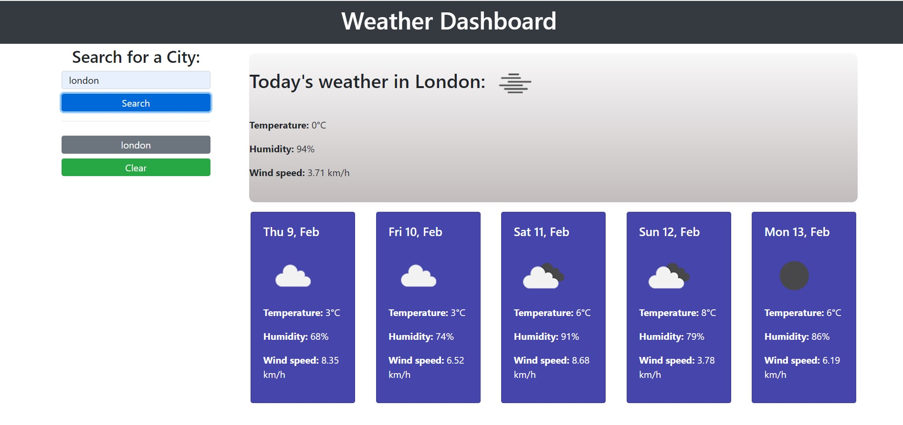
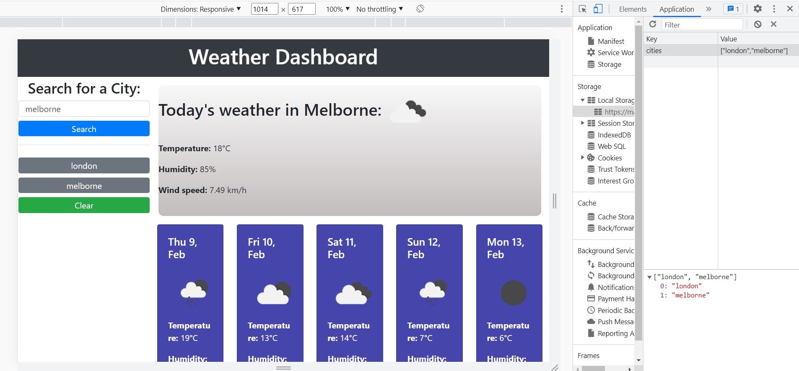

# Weather-Dashboard

## Description

link: https://mateusuk.github.io/Weather-Dashboard/
When a user searches for a city they are presented with current and future conditions for that city and that city is added to the search history.

When a user views the current weather conditions for that city they are presented with:

The city name

The date

An icon representation of weather conditions

The temperature

The humidity

The wind speed

When a user views future weather conditions for that city they are presented with a 5-day forecast that displays:

The date

An icon representation of weather conditions

The temperature

The humidity

When a user clicks on a city in the search history they are again presented with current and future conditions for that city.

## Installation

N/A

## Usage

## Credits

N/A

## License

Mit.

